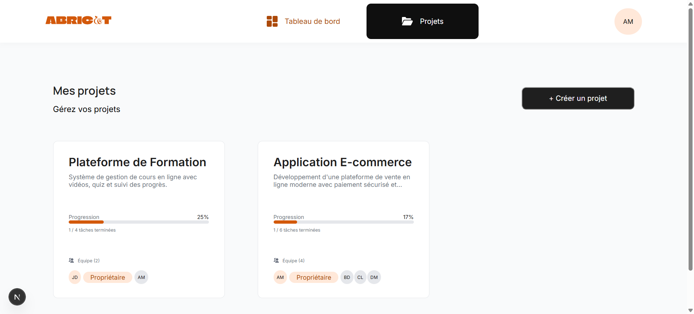

# Abricot

**Abricot** est un SaaS de gestion de projets et de tâches en équipe : création de projets,
attribution de tâches à des contributeurs, suivi d'avancement et commentaires.

Projet réalisé dans le cadre de la formation Développeur Full-Stack (OpenClassrooms).
L'API REST était fournie ; le travail porte sur l'application front-end.

| Dossier                           | Contenu                                              |
| --------------------------------- | ---------------------------------------------------- |
| [`front-end/`](front-end)         | Application Next.js — le code réalisé pour ce projet |
| [`back-end/`](back-end/README.md) | API REST fournie (Express, Prisma, SQLite)           |



## Sommaire

- [Stack technique](#stack-technique)
- [Prérequis](#prérequis)
- [Installation](#installation)
- [Démarrage](#démarrage)
- [Comptes de test](#comptes-de-test)
- [Scripts disponibles](#scripts-disponibles)
- [Structure du projet](#structure-du-projet)
- [Conventions de code](#conventions-de-code)
- [Accessibilité](#accessibilité)
- [Responsive](#responsive)
- [Écarts constatés avec la documentation de l'API](#écarts-constatés-avec-la-documentation-de-lapi)
- [Écarts constatés avec la maquette](#écarts-constatés-avec-la-maquette)

## Stack technique

Chaque dépendance du `package.json` du front-end est justifiée ci-dessous.

### Dépendances de production

| Paquet                | Version | Rôle                                                                                                                              |
| --------------------- | ------- | --------------------------------------------------------------------------------------------------------------------------------- |
| `next`                | 16.3.5  | Framework React : routage par fichiers (App Router), composants serveur, métadonnées SEO et protection des routes via `proxy.ts`. |
| `react` / `react-dom` | 19.2.8  | Bibliothèque d'interface, socle de Next.js.                                                                                       |
| `sass`                | ^1.104  | Préprocesseur CSS utilisé avec les CSS Modules : variables du design system, imbrication et mixins, sans nom de classe global.    |

Aucune bibliothèque de composants ni de gestion d'état n'a été ajoutée : les besoins du
projet (formulaires contrôlés, appels API, état local et partagé) sont couverts par React
seul, via ses hooks et son API de contexte. Les appels réseau utilisent l'API `fetch`
native, sans client HTTP supplémentaire.

### Dépendances de développement

| Paquet                                                          | Rôle                                                                                              |
| --------------------------------------------------------------- | ------------------------------------------------------------------------------------------------- |
| `typescript`, `@types/node`, `@types/react`, `@types/react-dom` | Typage statique : les réponses de l'API sont décrites dans `src/types/`.                          |
| `eslint`, `eslint-config-next`                                  | Analyse statique, incluant les règles d'accessibilité `jsx-a11y` et les bonnes pratiques Next.js. |
| `prettier`                                                      | Formatage automatique et homogène du code.                                                        |

## Prérequis

- **Node.js 20 ou supérieur** (développé avec Node 24.19)
- **npm** (le projet utilise `package-lock.json`)

## Installation

### 1. L'API

```bash
cd back-end
npm install
```

Renommer `.env.example` en `.env`, y définir une valeur pour `JWT_SECRET`, puis préparer la
base de données et les données de démonstration :

```bash
npx prisma generate
npx prisma migrate deploy
npm run seed
```

Le détail figure dans le [README du back-end](back-end/README.md).

### 2. Le front-end

```bash
cd front-end
npm install
```

Créer un fichier `.env.local` dans `front-end/` :

```bash
NEXT_PUBLIC_API_URL=http://localhost:8000
```

Le préfixe `NEXT_PUBLIC_` est nécessaire pour que la variable soit lisible depuis le
navigateur. Ce fichier n'est pas versionné.

## Démarrage

Les deux serveurs doivent tourner en parallèle, dans deux terminaux.

```bash
cd back-end && npm run dev
```

L'API écoute sur le port **8000**, sa documentation Swagger est disponible sur
<http://localhost:8000/api-docs>.

```bash
cd front-end && npm run dev
```

L'application est disponible sur <http://localhost:8001>.

> **Le port 8001 n'est pas arbitraire** : la configuration CORS de l'API n'autorise que
> les origines `localhost:8000` et `localhost:8001`. Démarrer le front sur un autre port
> fait échouer tous les appels réseau.

## Comptes de test

La base de démonstration est alimentée par `npm run seed` (dans `back-end/`). Elle
contient 10 comptes partageant le même mot de passe :

| Email               | Mot de passe  |
| ------------------- | ------------- |
| `alice@example.com` | `P@ssword123` |
| `bob@example.com`   | `P@ssword123` |
| …                   | …             |

## Scripts disponibles

Depuis le dossier `front-end/` :

| Commande           | Description                                           |
| ------------------ | ----------------------------------------------------- |
| `npm run dev`      | Démarre le serveur de développement sur le port 8001. |
| `npm run build`    | Compile l'application pour la production.             |
| `npm run start`    | Démarre l'application compilée sur le port 8001.      |
| `npm run lint`     | Analyse le code avec ESLint.                          |
| `npm run format`   | Formate l'ensemble du code avec Prettier.             |
| `npx tsc --noEmit` | Vérifie les types sans générer de fichiers.           |

## Structure du projet

```
.
├── back-end/                     # API fournie (non modifiée)
└── front-end/
    └── src/
        ├── app/                  # Routage (App Router)
        │   ├── (app)/            # Pages authentifiées : en-tête et pied de page communs
        │   │   ├── dashboard/
        │   │   ├── projects/
        │   │   └── profile/
        │   ├── (auth)/           # Pages publiques : connexion et inscription
        │   │   ├── login/
        │   │   └── register/
        │   └── layout.tsx        # Layout racine : polices, métadonnées globales
        ├── components/           # Composants réutilisables (un dossier par composant)
        │   ├── Cards/
        │   ├── buttons/
        │   ├── forms/
        │   ├── icons/            # Icônes SVG converties en composants React
        │   └── tags/
        ├── context/              # UserContext : profil connecté, chargé une seule fois
        ├── services/             # Appels à l'API, regroupés par domaine
        │   ├── api.ts            # Fetch commun : URL, en-têtes, token, gestion des erreurs
        │   ├── authService.ts
        │   ├── dashService.ts
        │   ├── projectService.ts
        │   ├── taskService.ts
        │   └── commentService.ts
        ├── types/                # Types TypeScript décrivant les réponses de l'API
        ├── utils/                # Fonctions pures (cookies, nom/prénom, équipe, progression)
        ├── styles/               # Variables, mixins et styles globaux
        └── proxy.ts              # Protection des routes (ex-middleware de Next.js)
```

Les parenthèses dans `app/` délimitent des **groupes de routes** : elles permettent de
partager un layout sans apparaître dans l'URL. `(app)/dashboard` répond donc à `/dashboard`.

### Authentification

Le token JWT renvoyé par l'API est stocké dans un cookie (`path=/`, `SameSite=Strict`) et
ajouté automatiquement en en-tête `Authorization` par `services/api.ts`.

`front-end/src/proxy.ts` vérifie la **présence** de ce cookie avant d'afficher une page
protégée et redirige vers `/login` le cas échéant. Il s'agit d'un confort de navigation,
pas d'une mesure de sécurité : la validité réelle du token est vérifiée par l'API, seule
détentrice de la clé de signature.

### Circulation des données

- **`services/`** interroge l'API et renvoie des données typées ; **`utils/`** les
  transforme (fonctions pures, sans appel réseau) ; les composants les affichent.
- **Le parent charge, l'enfant affiche** : une liste (`ProjectList`) effectue les appels et
  passe chaque élément à un composant de présentation (`ProjectCard`), qui reste
  réutilisable et testable.
- **Le profil de l'utilisateur connecté** transite par un contexte React
  (`context/UserContext.tsx`) : chargé une seule fois pour toute la zone authentifiée, il
  expose aussi un `refresh()` que le formulaire de profil appelle après modification, afin
  que l'en-tête reflète immédiatement le changement.

- **Les tâches et les commentaires** sont tenus dans l'état du composant qui possède la
  modale, jamais dans la carte : après une création, une modification ou une suppression,
  la liste est mise à jour localement par un `setState` fonctionnel plutôt que par un
  rechargement complet, ce qui évite un aller-retour réseau et tout clignotement.
- **Les filtres et la recherche** s'appliquent côté client sur les données déjà chargées.
  Le tri par priorité est lui aussi réalisé côté front : l'API trie `priority` par ordre
  alphabétique, ce qui ne correspond pas à l'ordre métier attendu.
- **La bascule liste / Kanban** est portée par l'URL (`?view=kanban`) et non par un état
  local, afin qu'un rechargement ou un lien partagé conserve la vue. La lecture se fait
  avec `useSearchParams()`, ce qui impose une frontière `<Suspense>` dans la page serveur.
- **La génération par IA** n'est pas branchée : la modale est purement visuelle et
  n'effectue aucun appel réseau (voir les écarts avec la maquette).

## Conventions de code

- **Code en anglais, interface en français** : noms de fichiers, de composants, de
  variables et d'URL en anglais (`/login`, `ProfileForm`, `firstName`) ; tous les textes
  affichés à l'utilisateur en français.
- **Un dossier par composant**, contenant le `.tsx` et son `.module.scss`.
- **CSS Modules** : aucun nom de classe global, pas de convention BEM nécessaire. Les
  couleurs et tailles proviennent de `src/styles/_variables.scss`.
- **Composants serveur par défaut** : la directive `"use client"` n'est ajoutée qu'aux
  composants ayant besoin d'interactivité ou de hooks. Les pages restent des composants
  serveur afin de pouvoir exporter leurs métadonnées.

## Accessibilité

L'objectif est la conformité **WCAG 2.1 niveau AA**. Principaux points traités :

- **Contrastes** : la couleur de marque `#D3590B` de la maquette n'atteint que 4,03:1 sur
  blanc, insuffisant pour du texte de taille normale. Une variante assombrie
  (`$color-brand-orange-text`) est utilisée pour le texte, la couleur d'origine étant
  conservée pour les icônes et les grands éléments, qui n'exigent que 3:1.
  Les couleurs système (succès, erreur, avertissement, information, désactivé) posaient le
  même problème sur leurs fonds clairs — entre 2,34:1 et 3,90:1. Leurs teintes de texte ont
  été assombries pour atteindre 4,5:1 au minimum, les fonds restant ceux de la maquette.
- **Navigation** : le lien de la page courante porte `aria-current="page"`, qui sert à la
  fois au style et à l'annonce par les lecteurs d'écran. Les états de focus sont visibles
  au clavier (`:focus-visible`).
- **Formulaires** : chaque champ possède un `<label>` associé, les consignes de saisie sont
  reliées par `aria-describedby`, les messages d'erreur portent `role="alert"` et les
  confirmations `role="status"`.
- **Composants dynamiques** : les barres de progression portent `role="progressbar"` et ses
  attributs `aria-valuenow` / `aria-valuemin` / `aria-valuemax`, afin que l'avancement ne
  soit pas une information uniquement visuelle.
- **Images et icônes** : les icônes décoratives sont masquées aux lecteurs d'écran
  (`aria-hidden="true"` ou `alt=""`) ; aucun bouton n'est laissé sans nom accessible.
- **Structure** : un seul `<h1>` par page et des niveaux de titres non sautés.
- **Composants interactifs sur mesure** : les cases à cocher et boutons radio stylés (choix
  des contributeurs, statut et priorité d'une tâche) reposent sur de vrais `<input>`
  masqués par une classe utilitaire `clip-path`, et non `display: none` ou
  `visibility: hidden` qui les retireraient de l'ordre de tabulation. Les sections
  dépliables utilisent `aria-expanded` et `aria-controls`, les bascules `aria-pressed`.
- **Identifiants uniques** : tout composant rendu en plusieurs exemplaires génère ses `id`
  avec `useId()`, pour éviter les doublons qui casseraient les relations ARIA.

Vérifications effectuées avec l'extension **WAVE**, les avertissements ESLint `jsx-a11y`,
et un parcours complet au clavier : navigation entre les pages, ouverture et fermeture des
modales (Échap et bouton dédié), déplacement dans les groupes de boutons radio avec les
flèches, et activation des sections dépliables — sans souris et sans perte du focus visible.

WAVE n'analysant que la page au repos, les modales ont été auditées séparément avec
**axe-core** injecté dans la page, modale ouverte. L'audit final porte sur les critères
WCAG 2.0 A/AA, 2.1 A/AA et 2.2 AA :

| Périmètre audité                                                                                                                | Résultat                                 |
| ------------------------------------------------------------------------------------------------------------------------------- | ---------------------------------------- |
| 9 états de page : connexion, inscription, tableau de bord (liste et Kanban), projets, projet (liste et Kanban), mon compte, 404 | 0 violation                              |
| 5 états de modale : projet, tâche, consultation de tâche, IA à vide et avec propositions                                        | 0 violation                              |
| Passe mobile à 375 px, et vérification du critère 1.4.10 (Reflow) à 320 px                                                      | 0 violation, aucun défilement horizontal |

Les tailles de police sont exprimées en `rem` et non en `em` : ces dernières se composent
d'un niveau d'imbrication à l'autre, ce qui faisait tomber certains textes sous la taille
voulue (11,67 px pour 12 px annoncés).

## Responsive

L'interface est adaptative sans framework CSS :

- marges fluides avec `clamp(min, préféré, max)` plutôt que des valeurs fixes ;
- grilles auto-adaptatives (`repeat(auto-fit, minmax(…))`) qui changent de nombre de
  colonnes sans media query ;
- aucune largeur fixe sur les composants réutilisables : `width: 100%` plafonné par
  `max-width` ;
- un seul point de rupture (749 px), centralisé dans un mixin `@include mobile`.

## Écarts constatés avec la documentation de l'API

Ces écarts ont été identifiés en comparant la documentation Swagger au code source du
backend, puis vérifiés par des appels réels à l'API.

| Constat                                 | Détail                                                                                                                                                                                                                                                                                              | Traitement côté front                                                                                                                                                                                                                                                                                                                                                                                                 |
| --------------------------------------- | --------------------------------------------------------------------------------------------------------------------------------------------------------------------------------------------------------------------------------------------------------------------------------------------------- | --------------------------------------------------------------------------------------------------------------------------------------------------------------------------------------------------------------------------------------------------------------------------------------------------------------------------------------------------------------------------------------------------------------------- |
| Routes non documentées                  | `PUT /auth/profile` et `PUT /auth/password` existent et fonctionnent, mais n'apparaissent pas dans Swagger (annotations absentes).                                                                                                                                                                  | Contrat lu dans `back-end/src/routes/authRoutes.ts` et vérifié par appel direct.                                                                                                                                                                                                                                                                                                                                      |
| Format des erreurs de validation        | Swagger annonce un tableau `details` à la racine ; l'API renvoie en réalité `data.errors`.                                                                                                                                                                                                          | Le type `ApiError` décrit la réponse réelle.                                                                                                                                                                                                                                                                                                                                                                          |
| Message de mot de passe incomplet       | `PUT /auth/password` n'indique pas le caractère spécial dans son message d'erreur, alors que sa validation l'exige.                                                                                                                                                                                 | La consigne affichée à l'utilisateur mentionne `(@$!%*?&)`.                                                                                                                                                                                                                                                                                                                                                           |
| Tri des priorités                       | `priority` est stocké comme une chaîne : le tri SQL est donc alphabétique. `/dashboard/assigned-tasks` trie en ordre croissant (`HIGH, LOW, MEDIUM, URGENT`) et `/projects/:id/tasks` en ordre décroissant (`URGENT, MEDIUM, LOW, HIGH`) — les deux sont incorrects, et différents l'un de l'autre. | Les tâches sont retriées côté client (`sortTasks`) selon l'ordre métier URGENT → LOW.                                                                                                                                                                                                                                                                                                                                 |
| Statut ignoré à la création d'une tâche | `POST /projects/:id/tasks` ne lit que `title`, `description`, `priority`, `dueDate` et `assigneeIds` : le `status` envoyé est ignoré et toute tâche naît en `TODO`.                                                                                                                                 | Un `PUT` est enchaîné immédiatement après la création lorsque le statut choisi n'est pas `TODO`.                                                                                                                                                                                                                                                                                                                      |
| Recherche d'utilisateurs isolée         | `GET /users/search?query=` (2 caractères minimum) est déclarée directement dans `back-end/src/index.ts` et non dans un fichier de `routes/`, ce qui la rend facile à manquer.                                                                                                                       | Utilisée pour le choix des contributeurs d'un projet.                                                                                                                                                                                                                                                                                                                                                                 |
| Nom unique                              | La maquette prévoit des champs « Nom » et « Prénom » distincts ; l'API ne stocke qu'un champ `name`.                                                                                                                                                                                                | Conversion dans `src/utils/name.ts` (format `"Prénom Nom"`), au prix d'une ambiguïté sur les prénoms composés.                                                                                                                                                                                                                                                                                                        |
| Progression non fournie                 | `GET /projects` ne renvoie que le nombre total de tâches (`_count.tasks`), sans leur statut ; `/dashboard/projects-with-tasks` ne renvoie que les tâches assignées à l'utilisateur, donc une progression partielle.                                                                                 | Les tâches de chaque projet sont chargées en parallèle (`Promise.all`) pour calculer l'avancement réel. Un champ agrégé côté API éviterait ces requêtes supplémentaires.                                                                                                                                                                                                                                              |
| Contributeurs inconnus ignorés          | `POST /projects` accepte une liste d'emails et ajoute silencieusement ceux qui correspondent à un compte existant, sans signaler les autres.                                                                                                                                                        | Le risque est écarté par l'interface, qui ne permet pas de saisir une adresse libre : les contributeurs se choisissent dans les résultats de `GET /users/search` et la touche Entrée est neutralisée dans le champ. Une vérification défensive compare malgré tout les adresses envoyées aux membres réellement reçus et avertit l'utilisateur le cas échéant, la modale restant ouverte pour que le message soit lu. |

## Écarts constatés avec la maquette

La maquette fournie présente plusieurs manques ou incohérences. Chaque arbitrage est
documenté ci-dessous.

| Constat                                                                                                                                                              | Choix retenu                                                                                                                                                                                                                                                                                                                    |
| -------------------------------------------------------------------------------------------------------------------------------------------------------------------- | ------------------------------------------------------------------------------------------------------------------------------------------------------------------------------------------------------------------------------------------------------------------------------------------------------------------------------- |
| Les écrans 404 et les versions mobiles ne sont pas fournis (maquette en 1440 px uniquement), alors que les deux sont attendus.                                       | Écrans composés à partir des éléments existants (logo, typographies, boutons) et déclinaison responsive décrite plus haut.                                                                                                                                                                                                      |
| Le tri des tâches est annoncé « par ordre de priorité », mais aucun écran ne permet de consulter ni de définir cette priorité.                                       | Un sélecteur de priorité a été ajouté dans la modale de tâche (l'API accepte ce champ dès la création) et la priorité est affichée sur chaque carte.                                                                                                                                                                            |
| Le bouton « Voir » des cartes du tableau de bord ne mène à aucun écran : aucune vue de détail d'une tâche n'est définie.                                             | La tâche s'ouvre dans la modale générique, qui réutilise le composant `TaskCard` (informations complètes et commentaires). Une page dédiée aurait permis le partage d'URL, mais aucune maquette ne la définissait.                                                                                                              |
| Aucun moyen de supprimer une tâche n'est prévu, alors que la route `DELETE` existe.                                                                                  | Suppression ajoutée dans la modale de modification, avec confirmation en deux temps.                                                                                                                                                                                                                                            |
| La modale de tâche ne propose que trois statuts ; l'API en connaît quatre (`CANCELLED`).                                                                             | Le statut « Annulée » est proposé à la saisie. En lecture, le filtre par défaut les masque (« Toutes sauf annulées ») et une option dédiée permet de les isoler ; en vue Kanban les colonnes sont dérivées du filtre, ce qui évite une colonne systématiquement vide.                                                           |
| Le choix des contributeurs d'un projet est présenté comme une liste déroulante, mais aucune route ne permet de lister les utilisateurs — seule une recherche existe. | Champ de recherche assorti d'une liste de résultats à cocher, et pastilles récapitulatives.                                                                                                                                                                                                                                     |
| Les assignés d'une tâche sont résumés dans le select (« 2 collaborateurs »), ce qu'un `<select>` natif ne permet pas.                                                | Select d'ajout + pastilles affichant chaque personne, avec retrait au clic.                                                                                                                                                                                                                                                     |
| Le lien « Mot de passe oublié » figure sur l'écran de connexion, sans route correspondante dans l'API.                                                               | Le lien est conservé pour signaler que la fonctionnalité est prévue, mais reste inactif : aucune route de l'API ne permettrait de le traiter.                                                                                                                                                                                   |
| Le second mode d'affichage de la page projet est intitulé « Calendrier ».                                                                                            | Rendu en vue Kanban. Le champ `dueDate` est nullable côté API : une vue calendrier ne saurait pas placer les tâches sans échéance. Arbitrage validé avec le mentor.                                                                                                                                                             |
| Les cartes de la vue Kanban affichent le statut de la tâche.                                                                                                         | La priorité est affichée à la place. Le statut est déjà porté par la colonne, tandis que les cartes sont triées par priorité : l'ordre d'affichage devient lisible au lieu de paraître arbitraire.                                                                                                                              |
| Deux écrans décrivent la génération de tâches par IA, sans fournisseur imposé.                                                                                       | Fonctionnalité non déployée (point bonus). La modale est implémentée et montre le parcours complet — saisie d'une consigne, puis propositions — mais les cartes retournées indiquent explicitement que l'IA reste à brancher, le choix du fournisseur revenant au client. Aucune clé d'API n'est donc embarquée dans le projet. |
| Aucun moyen de modifier une tâche depuis le tableau de bord.                                                                                                         | Un bouton de modification a été ajouté dans la modale de consultation (suggestion du mentor). Les collaborateurs assignables n'étant pas renvoyés par `/dashboard/assigned-tasks`, le projet est chargé à la volée à l'ouverture de l'édition.                                                                                  |

## Maquettes

Lien vers la maquette :
https://www.figma.com/design/4dE90dtmpQNUS05IGd9HxT/Abricot?node-id=0-1&p=f&t=pU8WLAdg5Raz9RdD-0

## Auteur

Alexandra Chanteloup — septembre 2026
Dépôt GitHub : https://github.com/AlexCh79/Abricot-solo-version
